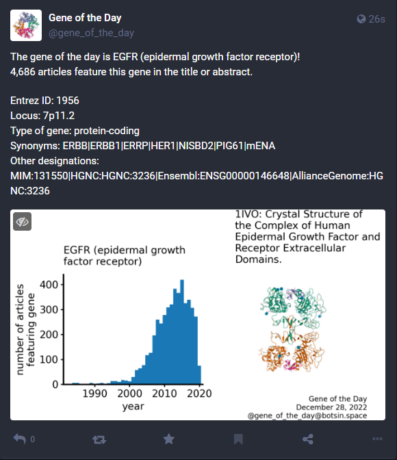

# Gene of the Day Bot

[](https://www.gnu.org/licenses/gpl-3.0)

A Mastodon bot that tweets the official* gene of the day. Currently live on [Mastodon](https://botsin.space/@gene_of_the_day)!

This bot runs every morning on a raspberry pi via a cron job:

```
0 8 * * * cd ~/Documents/gene_bot/src && /usr/bin/python3 ~/Documents/gene_bot/src/build_bot.py
```

Please provide feedback/ask questions by [opening an issue](https://github.com/amarallab/gene_bot/issues).

*_According to numpy's random number generator._

## Example post:



### Data versions:
PDB data current as of: Dec 28, 2022\
Uniprot data current as of: Aug 2, 2022\
Pubtator data current as of: Nov 11, 2021\
NCBI Gene data current as of: Aug 16, 2022
